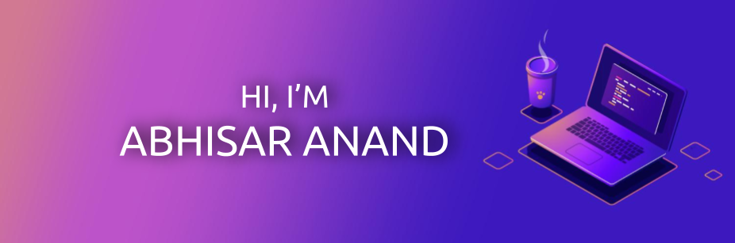
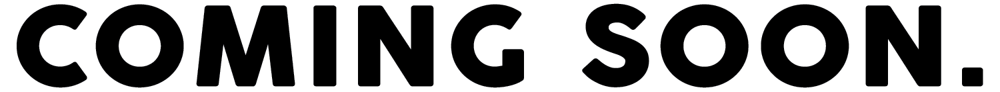

<!--### Hi there 👋-->
[](https://abhisaranand.github.io/)
# Hi there 

[](https://linkedin.com/in/abhisar-anand)
<!--[](https://gkassym.netlify.app)
[](https://twitter.com/GKassym)
[](https://instagram.com/gkassym/)
[](https://medium.com/@gapur.kassym)
[](https://t.me/GKassym)-->

### Thank you for visiting! 
#### Website 

## A Little About Me
  Hey, I'm an aspiring data scientist who loves tackling real-world issues: be it ideas from various fields, people from various teams, or applications from different industries. Some of my projects include AI Detection of Epileptic Seizures, Mask Detector, Occupation Tracker, Car Speed Detector, and "Drivector" (A product that prevents drivers to be distracted on the wheel). I have experience implementing my project in the real world such as the Mask Detector and the Occupation Tracker which were implemented at the local temple. I have strong technical skills in engineering, machine, and deep learning. My passion lies in solving business problems with tailored data and algorithms and communicating complex ideas to non-technical stakeholders. I am able to jump across verticals to deliver high-performing AI solutions. Apart from my academics, I’ve taken on various leadership roles, including being the captain for our school junior-varsity volleyball team, mentoring and teaching kids various STEM topics and leading teams for various competitions. This summer break, I'm interested in a part-time data science or machine learning internship. Please feel free to get in touch with me via email at abhisar.muz@gmail.com

A more detailed Resume can be found here: https://tinyurl.com/AbhisarAnandResume
Linktree: https://linktr.ee/AbhisarAnand

## 📈 **My GitHub Stats:**

  
  

## 📊 **This Week I Spent My Time On:**
<!--START_SECTION:waka-->

```text
Other              12 hrs 31 mins  ███████████████▓░░░░░░░░░   62.03 %
```

<!--END_SECTION:waka-->
#### **Note: I spend a lot of time using Jupyter Notebooks which Wakatime counts as Other.**
<!--
**AbhisarAnand/AbhisarAnand** is a ✨ _special_ ✨ repository because its `README.md` (this file) appears on your GitHub profile.

Here are some ideas to get you started:

- 🔭 I’m currently working on ...
- 🌱 I’m currently learning ...
- 👯 I’m looking to collaborate on ...
- 🤔 I’m looking for help with ...
- 💬 Ask me about ...
- 📫 How to reach me: ...
- 😄 Pronouns: ...
- ⚡ Fun fact: ...
-->
